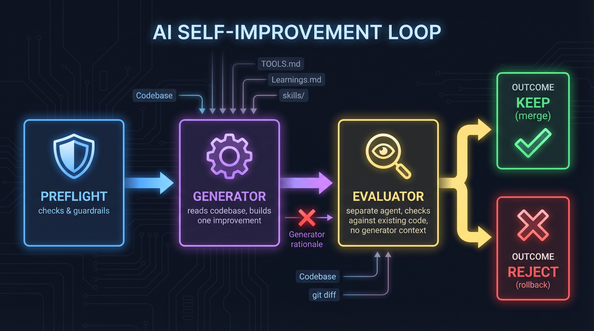

# NFH Self-Improvement Loop

An adversarial framework for AI agent self-modification, built and battle-tested in production. Inspired by [karpathy/autoresearch](https://github.com/karpathy/autoresearch).

## The Idea

Give an AI agent the ability to modify its own codebase, then use a separate agent to decide if the change is actually good. Keep it, or throw it away. Repeat.

The hardest part isn't the implementation — it's the discipline of **separation**. The same agent must never build and judge its own work.

## How It Works



### Pre-flight Checks

Before any cycle runs, a set of mandatory checks must pass:

- Timer and duration are set (prevents runaway loops)
- A fresh `dev` branch exists with no stale commits
- `state.json` exists for tracking
- Generator and evaluator prompts exist
- Agent verification script is present and executable

### Generator

The generator is a context-aware agent. Before building anything, it reads the existing workspace to find real opportunities:

- **TOOLS.md** — what tools and services exist, what's available to combine
- **Learnings.md** — documented friction points, known failures, past mistakes to avoid repeating (maintained by the [Reflect skill](https://github.com/theprint/openclaw-reflect-skill))
- **USER.md** — user preferences, working style, current priorities and context
- **MEMORY.md** — current situation, active projects, what matters right now
- **projects/tasks/** — existing task backlog, anything aging or blocked
- **skills/** — installed skills, any combinable or underused capabilities

It then proposes and builds **one** improvement per cycle from three categories:

| Category | Focus | Example |
|----------|-------|---------|
| **New Capabilities** | Build things that don't exist yet | New scripts, integrations, skills, workflows |
| **Optimization** | Make what exists work better | Bug fixes, error handling, reduced friction, dead code cleanup |
| **Discovery** | Find new ways to use what's already there | Surface underused tools, find integration gaps, document opportunities |

The generator's rationale — *why* it chose this improvement, what problem it solves, why it's valuable — is intentionally **not shared** with the evaluator. The code change must stand on its own merits.

Constraints:
- One improvement per cycle
- No edits to identity or memory files (MEMORY.md, USER.md, SOUL.md)
- No external API calls or messages
- Never pushes to main directly
- No feedback from evaluator — next cycle starts fresh

### Evaluator

The evaluator is a **separate agent/model** with a different job entirely. Where the generator asks "what would be valuable to build?", the evaluator asks "is this change actually good?"

It receives:
- The `git diff` (what changed)
- Access to the existing codebase (TOOLS.md, AGENTS.md, Learnings.md, skills/, etc.)
- The ability to search both `main` and `dev` branches for duplicates

It does **not** receive:
- The generator's rationale or proposal text
- Any "why this is good" framing
- The generator's context about user priorities or preferences (USER.md, MEMORY.md)

This asymmetry is deliberate. The generator's context (user preferences, priorities, emotional state) is useful for *choosing what to build*. But the evaluator needs to judge the code objectively — does it actually work? Is it redundant? Does it break anything? Knowing "the user really wanted this" would bias the evaluation toward approval.

The evaluator checks for:
- Duplicate functionality on any branch
- Use of services/skills not confirmed as configured
- Incomplete or speculative changes
- Over-engineered solutions for unclear benefit
- Conflicts with existing code

Decision: **APPROVE** (merge to main) or **REJECT** (rollback dev branch). Default mindset: reject unless proven valuable.

### Hard Blocks (Non-Negotiable Enforcement)

Two enforcement scripts run before any merge can happen:

**`verify-agents.sh`** — Ensures generator and evaluator are different sessions:
- Reads `generator_session_id` and `evaluator_session_id` from `state.json`
- Aborts if either is missing or if they match
- This is the cardinal rule: same agent for generation and evaluation = theater

**`hard-blocks.sh`** — Enforces three additional invariants:
1. **Single change limit** — If more than 3 files changed in a cycle, it's a batch operation. Batch operations are forbidden. Auto-rollback to main.
2. **Separate agents** — Generator and evaluator session IDs must exist in `state.json` and must differ.
3. **Verdict recorded** — `last_verdict` must be `APPROVE` before any merge. No verdict = evaluation never ran.

These scripts are called by `orchestrate.sh` and exit with code 1 on any violation. The loop stops immediately. These are not suggestions enforced by prompts — they are bash scripts that cannot be talked around.

### Why Two Scripts?

`verify-agents.sh` was the original guardrail. After a production failure where a single sub-agent bypassed all evaluation (see Lessons Learned #8), `hard-blocks.sh` was added to enforce additional invariants that the original architecture didn't cover:
- Batch detection (the failure mode: a sub-agent made 10 changes in one session with zero evaluation)
- Verdict verification (ensuring evaluation actually happened before merge)

Together they form a defense-in-depth approach.

## Why This Architecture

The original implementation used the same agent for both generation and evaluation. The results were predictable:

- 82% approval rate — not a sign of quality, but of failure
- Vague "looks good" evaluations with no real scrutiny
- Self-congratulatory noise that wasted compute and produced zero value

After multiple failed runs, the architecture was rebuilt with enforced separation:

1. **Separate agents** via isolated sessions with different models
2. **Different context for different roles** — generator gets user context to choose wisely; evaluator gets codebase context to judge objectively
3. **Hard guardrails** — verification scripts that abort on same-session violations
4. **State tracking** — every cycle is logged with mode, decision, and approval rate
5. **Mode rotation** — cycles rotate through refactor, discover, and combine to prevent the generator from fixating on one category

## Inspiration

Directly inspired by [karpathy/autoresearch](https://github.com/karpathy/autoresearch), where an AI agent modifies training code, runs experiments, and keeps or discards based on results. The core insight is the same: let the agent iterate, but gate every change behind real scrutiny.

Where this differs: autoresearch evaluates against a training metric (loss). This loop evaluates against a separate AI agent's judgment of code quality and redundancy, making it applicable to any codebase — not just ML training runs.

## Usage

### Prerequisites

- [OpenClaw](https://github.com/openclaw/openclaw) — for spawning isolated sub-agent sessions
- Git — branch-based isolation

### Quick Start

```bash
chmod +x nfh.sh orchestrate.sh preflight.sh verify-agents.sh hard-blocks.sh
./nfh
```

That's it — runs a 15-minute loop with default settings. Customize with arguments:

```bash
./nfh time=7200            # 2-hour run
./nfh cycles=10            # Exactly 10 cycles
./nfh cycles=12 time=7200  # 12 cycles or 2 hours, whichever comes first
```

### Arguments

| Argument | Default | Description |
|----------|---------|-------------|
| `time=N` | `900` (15 min) | Run duration in seconds |
| `cycles=N` | `0` (unlimited) | Maximum cycles to run. Stops at N regardless of time |

### Model Configuration

Edit `generator-prompt.md` and `evaluator-prompt.md` to reference your preferred models. The generator and evaluator should use **different models** for the best adversarial dynamic.

## Project Structure

```
self-improvement/
├── nfh.sh                # Quick-launch wrapper
├── orchestrate.sh          # Main loop controller
├── preflight.sh            # Mandatory checks before any cycle
├── verify-agents.sh        # Hard guardrail: enforces separate sessions
├── hard-blocks.sh          # Hard guardrail: batch detection, verdict verification
├── generator-prompt.md     # Instructions for the generator agent
├── evaluator-prompt.md     # Instructions for the evaluator agent
├── proposal-template.md    # Template for improvement proposals
├── PLAN.md                 # Architecture documentation
├── state.json              # Run tracking, cycle stats, session IDs
└── proposals/              # Completed proposals for review
```

## Lessons Learned

1. **Same agent = no evaluation.** If generator and evaluator share a session, the entire process is theater. This is the cardinal rule.
2. **82% approval = evaluator failure.** A healthy rejection rate should be significant. Default to REJECT.
3. **Context for evaluator ≠ generator context.** The generator needs user context (preferences, priorities) to choose what to build. The evaluator needs codebase context (what exists, what's redundant, behavioral rules in AGENTS.md) to judge quality. Giving the evaluator the generator's rationale biases it toward approval.
4. **Document the architecture, then enforce it in code.** A PLAN.md that says "use separate agents" while the code uses the same session is a bug. Verification scripts beat documentation.
5. **Guardrails over instructions.** Hard constraints (separate sessions, abort on violation) are more reliable than prompts telling the agent to behave.
6. **Prompts are not guardrails.** In production, a sub-agent was spawned with a text description of the loop architecture. It ignored every instruction — batched 10 changes, never spawned a separate evaluator, never ran any verification script, and merged everything with 100% approval. The fix was adding `hard-blocks.sh` — a script that exits 1 (non-negotiable) on violation. Every architectural rule must have a corresponding script that can't be talked around.
6. **Track everything.** State JSON with session IDs, approval rates, and mode rotation catches patterns (like approval rate creep) before they become systemic.
7. **Mode rotation prevents fixation.** Without it, the generator will propose the same type of improvement repeatedly.

## License

MIT

---

Built with [OpenClaw](https://github.com/openclaw/openclaw). Inspired by [karpathy/autoresearch](https://github.com/karpathy/autoresearch).
